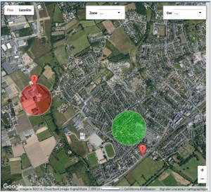

#  Vera-Plugin-Xee

Retrieve the informations of your [XeeConnect](http://xee.com/) in your [Vera Control, Ltd.](http://getvera.com/) Home Controller.

 

 The XeeConnect transforms your car in a connected car, through its diagnostic port (ODB) and a GPRS connectivity.

The plugin Xee for the Vera, gets the informations about your car in the Xee Cloud and allows you to use them in your Home Automation system.
You will be able to handle several car events (localization, lock status, fuel level, ...) and define geofences.

A scene example :
If the car is in the zone of the house and is unlocked since several minutes, then send a warning to remind locking the car.

 
 

**Compatible with UI7 / VeraPlus, VeraEdge, Vera3, VeraLite / [openLuup](https://github.com/akbooer/openLuup)**

More informations here : http://www.touteladomotique.com/forum/viewtopic.php?f=48&t=18148
